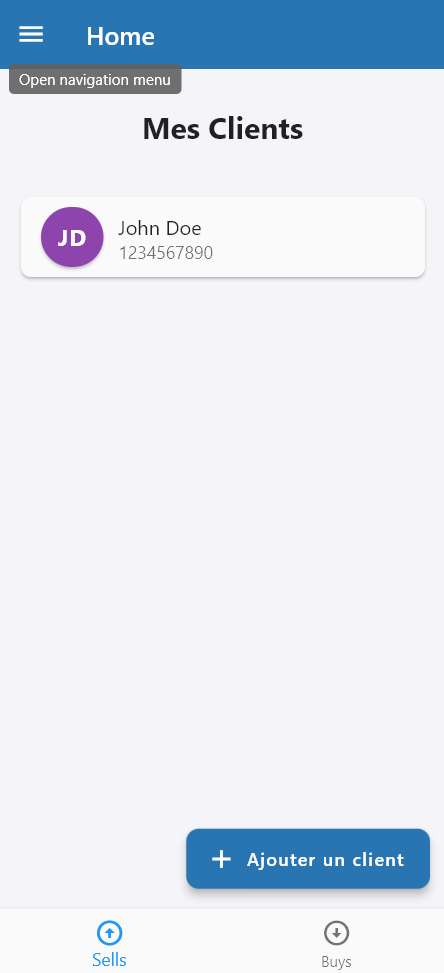
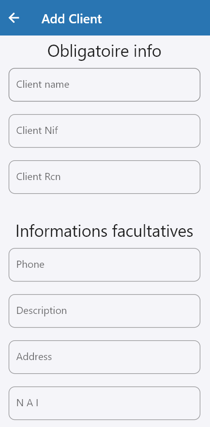
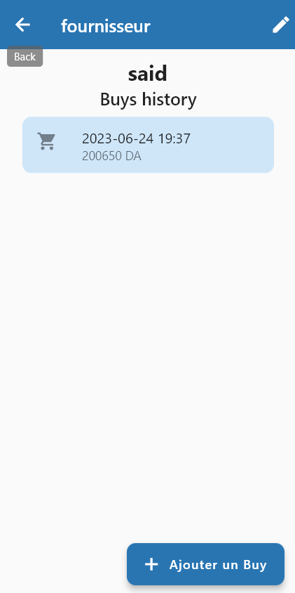
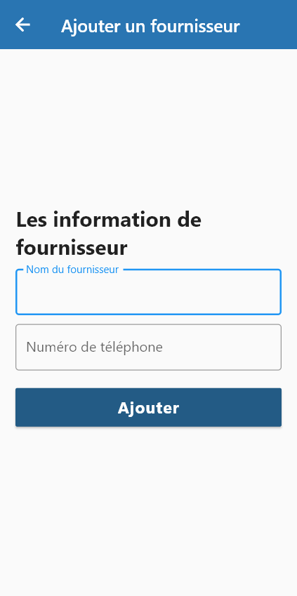
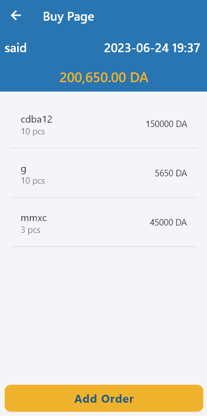
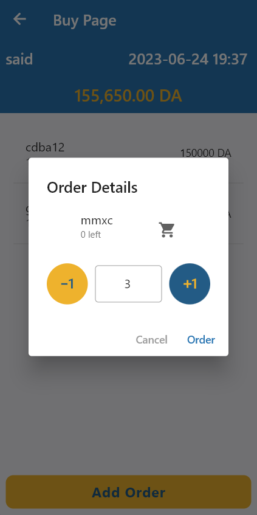
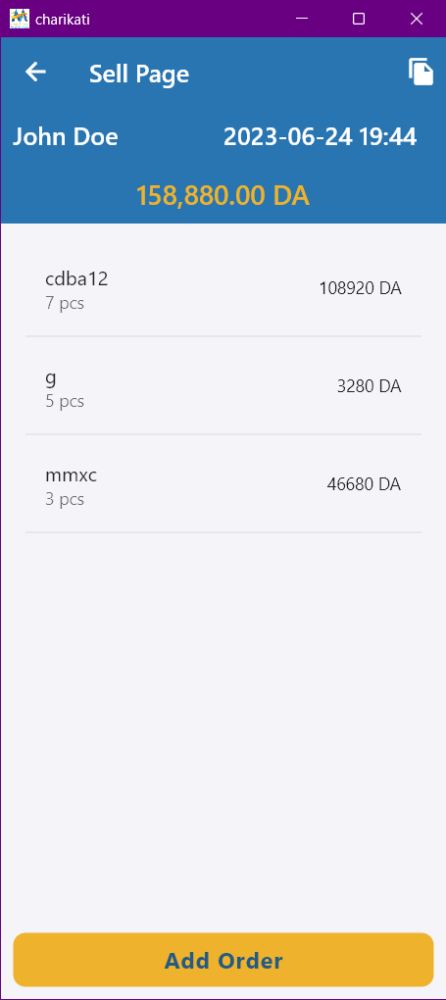
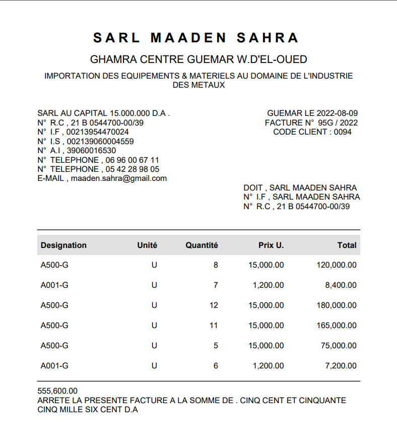

# Charikati Mobile App
Charikati is a mobile app designed to help users efficiently manage their clients and suppliers, as well as track buying and selling operations. The app offers a range of features to streamline the management process and enhance productivity.

# Technology Stack
The Inventory Mobile App is built using the following technologies and frameworks:
- **Mobile App**: Flutter
- **State Management**: GetX
- **API**: Spring Boot
- **Database**: MySQL

# Features
## Client Management:
Easily add, edit, and view client details such as name, contact information, and address. Maintain a comprehensive list of clients for quick access and effective communication.

  
   
       
  

## Supplier Management:
Keep track of suppliers and their information, including contact details .

  
   

## Buy Operations:
Record and track buying operations, including the date, supplier, products purchased, quantities, and prices. Maintain a detailed history of all purchases for reference and analysis.

  
   
     
  

## Sell Operations:
Capture and manage sell operations, enabling users to create and customize invoices for their clients. Generate professional invoices that include itemized product details, prices, quantities, and total amounts.

  
   
  

## Invoice Printing:
Print invoices directly from the app, providing users with a convenient way to share transaction details with clients. Enhance professionalism and streamline communication with printable invoices.

  
   
  

